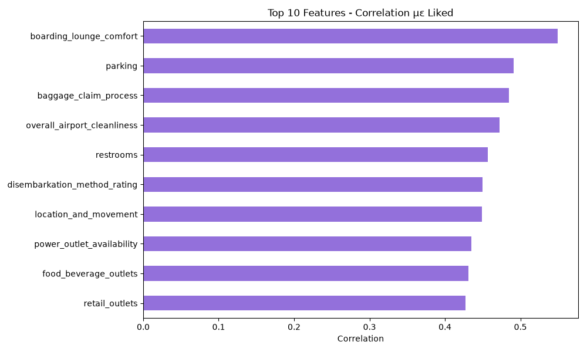

#  Airline Passenger Satisfaction - ML Pipeline

End-to-end machine learning pipeline for predicting airline passenger satisfaction.

##  Dataset

- **Source:** [Kaggle - Real Airline Passenger Satisfaction Dataset](https://www.kaggle.com/datasets/rustam32/real-airline-passenger-satisfaction-dataset)
- **Samples:** 57,514
- **Features:** 145
- **Target variable:** `liked` (0 = Not Satisfied, 1 = Satisfied)

---

## 1. Problem Description

**Domain:** Airport & Airline Services  
**Problem type:** Binary Classification  
**Target variable:** `liked` — whether a passenger was satisfied with their overall airport experience.  
This is a useful prediction task because understanding what drives passenger satisfaction allows airports to prioritize service improvements.

---

## 2. Dataset Description

| Property | Value |
|----------|-------|
| Total samples | 57,514 |
| Total features | 145 |
| Categorical features | 14 |
| Numerical features | 131 |
| Missing values | 0 (some `<null>` strings in categoricals) |
| Class balance | 50% / 50% |

### Feature Categories
- **Process info:** process, flight_type, connection, ticket info
- **Ratings (~60 columns):** checkin, security, food, parking, restrooms, etc.
- **Demographics:** gender, age_group, nationality, education, household_income
- **Trip info:** trip_purpose, traveling_alone, number_of_companions
- **Applicability flags (~60 columns):** binary indicators (0/1) showing if a rating was applicable

### Target Distribution
| Class | Count | Percentage |
|-------|-------|------------|
| 0 - Not Satisfied | 28,757 | 50% |
| 1 - Satisfied | 28,757 | 50% |

---

## 3. Preprocessing Approach

**Split first, preprocess second** — all statistics derived from training set only.

| Step | Strategy | Reason |
|------|----------|--------|
| Split | 80/10/10 stratified | Preserve class balance |
| Drop columns | 59 `_is_applicable` + `flight_type` + `gender` | Not statistically significant (chi-square p>0.05) |
| Missing values | Numerical→median, Categorical→mode (from train only) | `<null>` strings replaced with NaN first |
| Outliers | IQR Winsorizing (bounds from train only) | Caps extreme values without removing rows |
| Encoding | LabelEncoder for all categoricals | Handles unseen labels in val/test |
| Time columns | `connection_wait_time` & `arrival_lead_time` converted from seconds to minutes | More interpretable scale |
| Scaling | StandardScaler (fitted on train only) | Required for Logistic Regression & Neural Network |

---

## 4. Feature Engineering

4 new features derived from EDA insights:

| Feature | Formula | Intuition |
|---------|---------|-----------|
| `comfort_score` | mean(boarding_lounge_comfort, thermal_comfort, acoustic_comfort) | Top correlated features with liked (r=0.55) |
| `cleanliness_score` | mean(overall_airport_cleanliness, restroom_cleanliness, restroom_maintenance) | Passengers evaluate cleanliness holistically |
| `price_quality_score` | mean(food_beverage_price_quality, retail_price_quality, parking_value_for_money) | Lowest rated services — key pain point |
| `queue_score` | mean(checkin_queue_wait_time, security_queue_wait_time) | Wait times affect overall satisfaction |

---

## 5. PCA Insights

- **61 components** needed to explain 90% of total variance
- First 2 components show **partial separation** between satisfied/not satisfied passengers
- Features with highest loadings on PC1: `boarding_lounge_comfort`, `overall_airport_cleanliness`, `restrooms`
- Consistent with EDA correlation findings


---

## 6. Model Comparison

All models evaluated on the **test set only** (5,752 samples).

| Metric | Random Forest | Logistic Regression | Neural Network |
|--------|--------------|---------------------|----------------|
| Accuracy | 80.44% | 80.75% | **81.73%** |
| Precision | 77.35% | 78.90% | **79.75%** |
| Recall | 86.09% | 83.97% | **85.05%** |
| F1-score | 81.49% | 81.35% | **82.32%** |
| AUC-ROC | 88.32% | 88.11% | **89.46%** |

### Discussion
- The **Neural Network outperformed both classical models** on all metrics
- Random Forest had the highest Recall (86.09%) but lower Precision
- Logistic Regression performed competitively after StandardScaler was applied
- The Neural Network used early stopping (stopped at epoch 17), suggesting fast convergence on this dataset
- The performance gap between models is small (~1-2%), suggesting the features are informative regardless of model complexity


---

## 7. Best Model Designation

** Best model: Neural Network** (`models/best_model.pt`)

Justified by highest F1-score (82.32%) and AUC-ROC (89.46%) on the test set.

### Architecture
Input(84) → Linear(128) → ReLU → Dropout(0.3)

→ Linear(64)  → ReLU → Dropout(0.2)

→ Linear(32)  → ReLU

→ Linear(1)   → Sigmoid
- **Optimizer:** Adam (lr=0.001)
- **Loss:** Binary Cross-Entropy
- **Early stopping:** patience=10, stopped at epoch 17

---

## EDA Highlights

### Key Findings
| Finding | Detail |
|---------|--------|
| **#1 driver of satisfaction** | `boarding_lounge_comfort` (r=0.55) |
| **Biggest pain point** | Food & retail prices (rated ~2/5) |
| **Most satisfied group** | Ages 18-25, Sports travelers |
| **Least satisfied group** | Ages 36-45, Business travelers |
| **Statistically significant** | process, age_group, trip_purpose, traveling_alone |
| **Not significant** | flight_type, gender |
| **Traveling with company** | Slightly more satisfied (51.6% vs 47.5%) |




---


## Installation & Execution

```bash
# 1. Clone the repo
git clone https://github.com/antoniakatsouri1-math/airline-passenger-satisfaction.git
cd airline-passenger-satisfaction

# 2. Create virtual environment
python -m venv .venv
source .venv/bin/activate  # Windows: .venv\Scripts\activate

# 3. Install dependencies
pip install -r requirements.txt

# 4. Run the full pipeline
python main.py
```

Results are saved in:
- `EDA/plots/` — EDA visualizations
- `src/plots/` — Model plots
- `models/` — Trained models & scaler